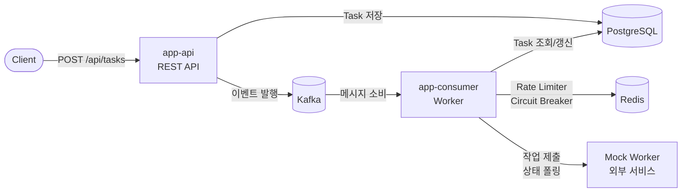

# Image Process Service

외부 이미지 처리 서비스(Mock Worker)와 연동하여 비동기 이미지 처리 작업을 관리하는 백엔드 서비스입니다.

---

## 실행 방법

### 사전 요구사항

- Docker, Docker Compose
- JDK 25+ (빌드 시)

### 빌드 및 실행

```bash
# 1. JAR 빌드
./gradlew clean build -x test

# 2. 전체 스택 실행 (PostgreSQL, Redis, Kafka, app-api, app-consumer)
docker compose -f compose.stress.yaml up -d --build
```

### 포트 정보

| 서비스 | 포트 | 설명 |
|--------|------|------|
| **app-api** | `18082` | REST API 서버 |
| **app-consumer** | `18081` | Kafka Consumer + 폴링 워커 |
| PostgreSQL | `25432` | 데이터베이스 |
| Redis | `36379` | Rate Limiter, Circuit Breaker 상태 저장 |
| Kafka | `29092` | 메시지 브로커 |

### 서비스 상태 확인

```bash
# 전체 컨테이너 상태 확인
docker compose -f compose.stress.yaml ps

# 로그 확인
docker compose -f compose.stress.yaml logs -f app-api app-consumer
```

### 종료

```bash
docker compose -f compose.stress.yaml down -v
```

---

## API 명세

API 문서(Scalar UI)는 서버 실행 후 `http://localhost:18082/scalar` 에서 확인할 수 있습니다.

### 1. 이미지 처리 요청

```
POST http://localhost:18082/api/tasks
Content-Type: application/json

{
  "imageUrl": "https://example.com/image.png"
}
```

**응답 (202 Accepted)**

```json
{
  "taskId": "01226N0640J7Q",
  "status": "PENDING",
  "createdAt": "2026-03-25T12:00:00Z"
}
```

### 2. 작업 상태 조회

```
GET http://localhost:18082/api/tasks/{taskId}
```

**응답 (200 OK)**

```json
{
  "taskId": "01226N0640J7Q",
  "jobId": "job_abc123",
  "imageUrl": "https://example.com/image.png",
  "status": "COMPLETED",
  "result": "처리 결과",
  "failReason": null,
  "retryCount": 0,
  "createdAt": "2026-03-25T12:00:00Z",
  "updatedAt": "2026-03-25T12:00:30Z"
}
```

### 3. 작업 목록 조회

```
GET http://localhost:18082/api/tasks?page=0&size=20&status=COMPLETED
```

페이지네이션과 상태 필터를 지원합니다.

---

## 아키텍처

### 시스템 구성

두 개의 독립적인 Spring Boot 애플리케이션으로 구성됩니다.



- **app-api**: 클라이언트 요청 수신, Task 생성, Kafka로 작업 제출 이벤트 발행
- **app-consumer**: Kafka 메시지 소비하여 Mock Worker에 작업 제출, 주기적 폴링으로 결과 수집

### 헥사고날 아키텍처 (Ports & Adapters)

```
core/domain/         순수 도메인 모델, 포트 인터페이스 (Spring 의존성 없음)
core/application/    유스케이스 구현 (포트 조합)
infra/persistence/   JPA + Flyway (PostgreSQL)
infra/redis/         Redis 기반 RateLimiter, CircuitBreaker
infra/mockworker/    Mock Worker HTTP 클라이언트 (RestClient)
infra/kafka/         Kafka Producer/Consumer 설정
app-api/             REST Controller (inbound adapter)
app-consumer/        Kafka Listener + 폴링 스케줄러 (inbound adapter)
```

의존성 방향: `adapter → application → domain`
domain은 순수 Kotlin만 사용하며 외부 프레임워크를 알지 못합니다.

---

## 상태 모델

### 상태 전이 다이어그램

```
                    ┌─────────────────────────────────────────────┐
                    │                                             │
  PENDING ──Submit──▷ SUBMITTED ──StartProcessing──▷ PROCESSING  │
     │                   │                              │        │
     │Fail            RetryWait                      RetryWait   │Complete
     │                   │                              │        │
     │              RETRY_WAITING ◁─────────────────────┘        │
     │                   │                                       │
     ▽     Fail          │  RecoverToSubmitted                   ▽
   FAILED ◁──────────────┘──────────────────▷ SUBMITTED     COMPLETED
```

### 상태 정의

| 상태 | 설명 | Terminal |
|------|------|----------|
| `PENDING` | 클라이언트 요청 접수 완료. Mock Worker에 미전송 | No |
| `SUBMITTED` | Mock Worker에 요청 전송 완료 (jobId 수신) | No |
| `PROCESSING` | Mock Worker가 작업 진행 중 | No |
| `COMPLETED` | 작업 완료, 결과 저장됨 | Yes |
| `FAILED` | 최종 실패 (재시도 초과 또는 복구 불가능 오류) | Yes |
| `RETRY_WAITING` | 일시적 실패 후 재시도 대기 중 | No |

### 허용되는 상태 전이

상태 전이는 DSL 기반 상태 머신으로 관리됩니다. 정의된 전이 외에는 모두 거부되며 예외가 발생합니다.

```
PENDING        → SUBMITTED, FAILED
SUBMITTED      → PROCESSING, FAILED, RETRY_WAITING
PROCESSING     → COMPLETED, FAILED, RETRY_WAITING
RETRY_WAITING  → SUBMITTED, FAILED
COMPLETED      → (전이 불가 — terminal state)
FAILED         → (전이 불가 — terminal state)
```

### 상태 전이 시 수행되는 액션

| 전이 | 액션 |
|------|------|
| `PENDING → SUBMITTED` | jobId 저장, nextPollAt 설정 |
| `* → FAILED` | failReason 저장, nextPollAt 제거 |
| `* → RETRY_WAITING` | retryCount 증가, nextPollAt 설정 (backoff) |
| `PROCESSING → COMPLETED` | result 저장, nextPollAt 제거 |
| `RETRY_WAITING → SUBMITTED` | 복구 (서버 재시작 시) |

### 설계 의도

**왜 서버가 자체 상태를 관리하는가?**

1. Mock Worker 장애 시에도 클라이언트에 일관된 상태 제공
2. 중복 요청 판별을 위한 기록 보관
3. 서버 재시작 후 미완료 작업 복구 (jobId 매핑 유지)
4. Mock Worker에 작업 목록 API가 없으므로 자체 관리 필요
5. 상태 전이 규칙을 서버 측에서 강제하여 무효 상태 방지

---

## 중복 요청 처리

- `imageUrl`의 SHA-256 해시를 fingerprint로 사용
- 동일 imageUrl 요청 시, 진행 중인(non-terminal) Task가 있으면 Mock Worker에 재전송하지 않고 기존 Task 반환
- fingerprint 컬럼에 **UNIQUE constraint** 적용 → 동시 중복 요청도 DB 레벨에서 방지
- 클라이언트에 별도 헤더(Idempotency-Key 등)를 강제하지 않음 — 요청 데이터 자체로 멱등성 보장
- 이전 작업이 완료(COMPLETED/FAILED)된 동일 URL은 새로운 Task 생성 가능

---

## 처리 보장 모델

**At-least-once delivery**

- Kafka 기반 메시지 전달: Task 생성 시 Kafka에 submit 이벤트 발행, Consumer가 실패하면 재시도
- `@RetryableTopic`으로 최대 3회 재시도 (지수 백오프), 실패 시 DLT(Dead Letter Topic)로 이동
- DLT 핸들러에서 Task를 FAILED로 전환하여 최종 실패 처리

**근거:**

- 이미지 처리는 누락보다 중복이 낫다 (결과가 동일하므로)
- exactly-once는 분산 환경에서 달성이 어렵고 복잡성 대비 이점이 적음
- at-most-once는 작업 유실 가능성이 있어 부적합
- Consumer 메서드에 `@Transactional` 적용 — DB 쓰기와 Kafka 오프셋 커밋의 원자성 보장

---

## 실패 처리 전략

### Mock Worker 요청 단계 (Kafka Consumer)

| 응답 | 처리 |
|------|------|
| **성공** | PENDING → SUBMITTED (jobId 저장), Circuit Breaker 성공 기록 |
| **5xx / 네트워크 오류** | `RetryableSubmitException` throw → Kafka 재시도 (최대 3회, 지수 백오프) |
| **429 Too Many Requests** | Circuit Breaker open, Kafka 재시도 |
| **4xx (400, 401, 404, 422)** | 즉시 FAILED 전이 (재시도 불필요) |
| **DLT 도달** | FAILED 전이, failReason: "Submit failed after all retries" |

### 폴링 단계 (Status Check)

| 응답 | 처리 |
|------|------|
| **PROCESSING** | SUBMITTED → PROCESSING 전이, nextPollAt 갱신 (backoff) |
| **COMPLETED** | PROCESSING → COMPLETED 전이, result 저장 |
| **FAILED** | PROCESSING → FAILED 전이, failReason 저장 |
| **5xx / 네트워크 오류** | RETRY_WAITING 전이, Circuit Breaker 실패 기록, 재시도 (최대 3회) |
| **429** | Circuit Breaker open (retry-after 초 동안), RETRY_WAITING 전이 |
| **최대 재시도 초과** | FAILED 전이, failReason: "Max retry count exceeded" |

---

## 폴링 부하 분산 전략

동시에 다수의 작업이 접수되면 폴링 타이머가 동시에 실행되는 thundering herd 문제가 발생합니다.
이를 계층적으로 방어합니다.

### 1. 작업별 `nextPollAt` 관리

고정 주기(`@Scheduled(fixedDelay)`)로 전체 작업을 순회하는 대신,
작업마다 다음 폴링 시각(`nextPollAt`)을 DB에 저장하고 `WHERE next_poll_at <= now()` 조건으로 조회합니다.

```
작업 생성 시 — 초기 폴링 시점 분산 (staggered scheduling)
  nextPollAt = now() + initialDelay + random(0..spreadWindow)

폴링 후 — exponential backoff + full jitter
  backoff = min(baseDelay × 2^pollCount, maxDelay)
  nextPollAt = now() + random(0..backoff)
```

### 2. Full Jitter (AWS 권장)

전체 딜레이를 `random(0, base × 2^attempt)`로 랜덤화합니다.
AWS Architecture Blog 시뮬레이션에서 가장 적은 총 호출 수와 가장 빠른 완료 시간을 달성한 전략입니다.

> 참고: Marc Brooker, "Exponential Backoff and Jitter," AWS Architecture Blog, 2015

### 3. Rate Limiter (Token Bucket) — Redis Lua Script

Redis에 Lua Script 기반 Token Bucket을 구현하여 Mock Worker에 대한 초당 요청 수를 하드캡합니다.
Lua Script로 토큰 확인과 차감을 원자적으로 수행하여 Race Condition을 방지합니다.
다중 인스턴스 환경에서도 전역적으로 요청률을 제어할 수 있습니다.

설정: 최대 10토큰, 초당 10토큰 리필

### 4. Circuit Breaker — Redis 기반 3-State

Mock Worker가 연속적으로 429/5xx를 반환하면 Circuit Breaker가 열려 폴링을 일시 중단합니다.
Redis에 상태를 저장하여 다중 인스턴스 간 Circuit Breaker 상태를 공유합니다.

```
CLOSED ──(failures ≥ threshold)──▷ OPEN ──(cooldown 경과)──▷ HALF_OPEN
  ▲                                                            │
  └──────────(성공)──────────────────────────────────────────────┘
                                                               │
                                            (실패) ──▷ OPEN (재진입)
```

설정: 실패 임계치 5회, cooldown 30초, half-open 최대 3회 호출, 실패 윈도우 60초

### 5. Virtual Thread 기반 병렬 I/O

스케줄러 내부에서 Virtual Thread를 사용하여 Mock Worker 폴링의 I/O 블로킹을 최소화합니다.

```
@Scheduled (매 2초)
  1. Circuit Breaker 상태 확인 — open이면 skip
  2. DB 조회: findPollableTasks(now(), budgetPerTick=50)
  3. Virtual Thread Executor로 각 작업을 병렬 폴링
  4. 각 폴링은 RateLimiter를 통해 Mock Worker 호출
  5. 결과에 따라 상태 전이 + nextPollAt 갱신
```

---

## 동시 요청 시 고려 사항

| 시나리오 | 대응 |
|----------|------|
| 동일 URL 동시 요청 | fingerprint UNIQUE constraint로 DB 레벨 중복 방지 |
| 동일 Task 동시 상태 변경 | JPA `@Version` 낙관적 잠금으로 충돌 감지 |
| 폴링 스케줄러 동시 실행 | `budgetPerTick` 제한으로 과부하 방지 |
| Kafka 메시지 중복 소비 | Consumer에서 Task 상태 확인 후 멱등 처리 (PENDING이 아니면 skip) |

---

## 트래픽 증가 시 병목 가능 지점

| 병목 지점 | 증상 | 대응 |
|-----------|------|------|
| Mock Worker 호출부 | 429 응답 증가, 응답 지연 | Token Bucket Rate Limiter + Circuit Breaker |
| 폴링 스케줄러 | 미완료 작업 폭증 시 폴링 지연 | `budgetPerTick` 기반 배치 크기 제한, nextPollAt 우선순위 |
| DB | 작업 수 증가 시 조회 성능 저하 | partial index (`status IN pollable AND next_poll_at`), 페이징 |
| Kafka Consumer | 메시지 적체 | 파티션 3개 + concurrency 3으로 병렬 소비, DLT로 독약 메시지 격리 |
| 작업 제출 | 대량 동시 요청 | Kafka로 비동기 제출 분리, app-api는 DB 저장 + 이벤트 발행만 수행 |

---

## 외부 시스템 연동 방식

### Mock Worker

- **RestClient** (Spring Framework 6.2+ 기본 HTTP 클라이언트) + `JdkClientHttpRequestFactory`
- `@Retryable`로 HTTP 레벨 재시도 (max 1회, 지수 백오프 100ms → 200ms)
- 타임아웃: connection 5s, read 10s
- API Key: `X-API-KEY` 헤더, 환경변수 `MOCK_WORKER_API_KEY`로 관리

### Kafka

- 작업 제출을 동기 HTTP가 아닌 Kafka 이벤트로 분리
- app-api는 Task 생성 후 즉시 202 응답 → 클라이언트 대기 시간 최소화
- `@RetryableTopic`으로 Consumer 실패 시 자동 재시도 + DLT 처리
- taskId를 Kafka key로 사용하여 동일 작업의 메시지 순서 보장

**왜 Kafka를 선택했는가:**

Mock Worker는 GPU 기반 AI 추론 서비스로, 응답 시간이 수 초~수십 초로 크게 변동합니다.
클라이언트 요청을 받는 app-api가 Mock Worker 호출까지 동기로 처리하면,
Mock Worker 지연이 API 응답 시간에 직접 영향을 미치고 스레드 고갈로 이어질 수 있습니다.

Kafka로 제출을 분리하면:
1. app-api는 DB 저장 + 이벤트 발행만 수행하여 빠르게 202 응답
2. Mock Worker 지연/장애가 API 서버에 전파되지 않음
3. Consumer를 독립 스케일 가능
4. 메시지 영속성으로 서버 재시작 시에도 작업 유실 방지

### Redis

- Rate Limiter, Circuit Breaker 상태를 Redis에 저장하여 다중 인스턴스 간 공유
- Lua Script로 원자적 연산 보장 (토큰 차감, 실패 카운트 증가)
- 키에 TTL을 설정하여 idle 상태 시 자동 정리

---

## 서버 재시작 시 동작

### 복구 프로세스

서버(app-consumer) 시작 시 `StartupRecoveryListener`가 미완료 작업을 자동 복구합니다:

1. `PENDING`, `SUBMITTED`, `PROCESSING`, `RETRY_WAITING` 상태의 모든 작업 스캔
2. **PENDING (jobId 없음)**: Kafka에 submit 이벤트 재발행 → Consumer가 Mock Worker에 재전송
3. **SUBMITTED / PROCESSING**: `nextPollAt`을 현재 시각 근처로 재설정 → 폴링 재개
4. **RETRY_WAITING**: SUBMITTED로 복구 후 폴링 재개

### 데이터 정합성이 깨질 수 있는 지점

| 시점 | 현상 | 영향 |
|------|------|------|
| Mock Worker에 요청 전송 후, jobId를 DB에 저장하기 전에 서버 종료 | PENDING 상태로 남아 재시작 시 중복 요청 발생 | Mock Worker 측 멱등 처리에 의존 (at-least-once 허용 범위) |
| Mock Worker에서 COMPLETED 전이 후, 폴링 전에 서버 종료 | SUBMITTED/PROCESSING 상태로 남음 | 재시작 후 폴링으로 복구 — 결과 데이터 손실 없음 |
| Kafka 메시지 소비 후, DB 커밋 전에 서버 종료 | Kafka offset 미커밋, 재시작 시 메시지 재소비 | Consumer 멱등 처리 (PENDING 아니면 skip) |
| DB 커밋 후, Kafka offset 커밋 전에 서버 종료 | 메시지 재소비 | 위와 동일, 멱등 처리로 안전 |

---

## 기술 스택

| 구성요소 | 선택 |
|---------|------|
| Language | Kotlin 2.3 |
| Framework | Spring Boot 4.0 |
| DB | PostgreSQL 17 |
| Message Broker | Apache Kafka 4.0 |
| Cache/Resilience | Redis 7 (Rate Limiter, Circuit Breaker 상태 공유) |
| Migration | Flyway |
| HTTP Client | RestClient + JdkClientHttpRequestFactory |
| Async I/O | Virtual Threads (JDK 25) |
| Test | JUnit 5, Kotest, MockK, Testcontainers |
| Container | Docker Compose |
| Lint | ktlint (official style) |

---

## 테스트

```bash
# 전체 테스트 (Testcontainers가 PostgreSQL, Redis, Kafka를 자동 실행)
./gradlew test

# 모듈별 테스트
./gradlew :core:domain:test
./gradlew :core:application:test
./gradlew :infra:mockworker:test
./gradlew :infra:redis:test
./gradlew :app-api:test
./gradlew :app-consumer:test
```
